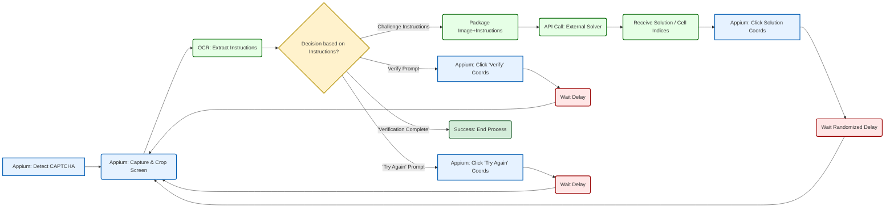

**Breaking the Unbreakable: A Practical Analysis of Arkose Labs' CAPTCHA Resilience via Orchestrated Visual Relay on iOS**

**Author:** Neverlow512

**Date:** 03 April 2025

**Classification:** TLP:WHITE (Suitable for Public Release)

**Preamble:** *This document details the successful development and application of a technique to automate the solving of Arkose Labs CAPTCHA challenges as implemented within a target iOS application, forming a critical part of a larger security research initiative. It follows previous research phases involving automation framework development and dynamic instrumentation diagnostics. The findings pertain to application behavior observed approximately six months prior to this publication and may not reflect the current state of the system. Specific implementation details that could facilitate misuse are omitted.*

**Disclaimer:** *I conducted this research for educational purposes and skill validation, focusing on understanding mobile application security postures. No harm was intended or caused to the services involved. The techniques described are presented for informational purposes and should not be used to violate Terms of Service or for malicious activities. I assume no liability for misuse of the information provided here.*

---

**Executive Summary:**

Building upon prior research which developed the OMEGA-T automation framework and subsequently used Frida for dynamic analysis, this study addresses the challenge posed by an obscured `WKWebView` rendering Arkose Labs CAPTCHA challenges within a target iOS application (Tinder). 

The Frida analysis confirmed that standard UI automation tools like Appium could not directly interact with the CAPTCHA elements and identified the `window.webkit.messageHandlers` JavaScript-to-native bridge as the communication channel for successful CAPTCHA tokens. Faced with this interaction barrier, I developed and successfully implemented a methodology termed **"Orchestrated Visual Relay"**. This technique leverages Appium primarily for UI control and visual capture, utilizes Optical Character Recognition (OCR) for parsing dynamic instructions presented with the CAPTCHA, integrates with an external, third-party CAPTCHA-solving service (unnamed) to handle the cognitive puzzle aspect, and uses coordinate-based interactions within Appium to apply the externally derived solution back to the obscured WebView. 
This approach effectively treats the CAPTCHA interface visually, circumventing the lack of direct element access. During testing approximately six months ago, this methodology demonstrated practical viability, achieving an overall success rate of around 80% in completing the multi-step CAPTCHA verification process within the application, thereby overcoming the specific implementation hurdle. 

This research highlights that while the CAPTCHA puzzles themselves may be complex, the implementation's reliance on visual presentation within an obscured WebView can still be vulnerable to bypass through externalization, providing valuable insights for enhancing mobile application security and CAPTCHA deployment strategies.

---

**1. Introduction: The Final Obstacle**

**1.1. Recap of Prior Research:** My previous work involved two distinct phases. First, the development of the OMEGA-T framework demonstrated the potential for scalable iOS account generation automation but was ultimately halted by the appearance of an advanced CAPTCHA mechanism ["OMEGA-T: An Orchestrated Mobile Environment Manipulation Framework for Scalable iOS Account Generation Analysis (Tinder Case Study)"](https://github.com/Neverlow512/OMEGA-T-Research/blob/main/README.md). Second, a diagnostic phase using Frida dynamic instrumentation revealed *why* standard automation failed – the CAPTCHA (identified as Arkose Labs) was rendered within an obscured `WKWebView`, making its internal elements inaccessible to Appium. Crucially, this Frida analysis also identified the specific `window.webkit.messageHandlers` JavaScript-to-native bridge used to communicate the solved CAPTCHA token back to the native application code ["Diagnostic Instrumentation: Using Frida to Navigate Obscured iOS WebView Challenges for Security Research"](https://github.com/Neverlow512/Frida-iOS-WebView-Investigation/blob/main/README.md). Direct interception or manipulation of this bridge was considered complex and potentially brittle for reliable automation.

**1.2. Research Question:** With direct interaction blocked and interception deemed impractical, the central question became: *Could a practical and reasonably reliable bypass be engineered for this specific Arkose Labs implementation by treating the obscured CAPTCHA interface purely visually, externalizing the puzzle-solving aspect, and relaying the solution back via coordinate-based UI automation?*

**1.3. Approach Overview:** To answer this, I pursued a strategy I term **"Orchestrated Visual Relay"**. This approach accepts the "black box" nature of the WebView and instead focuses on automating the process flow as a human user might perceive it visually, albeit orchestrated programmatically and leveraging external services for the core puzzle-solving task.

---

**2. Methodology: Orchestrated Visual Relay**

**2.1. Conceptual Framework:** The core concept acknowledges the failure of direct element interaction within the WebView. Instead, the framework treats the mobile screen visually. Appium acts as the "eyes" (capturing screenshots) and the "hands" (performing coordinate-based clicks), while an external CAPTCHA-solving service acts as the "brain" for interpreting the visual puzzle and providing the solution. This decouples the puzzle-solving logic from the constrained environment of the app's WebView.

**2.2. Key Components & Workflow:** The process involves a cyclical interaction orchestrated by a Python script:

*   **UI Automation & Control (Appium):** Used to:
    *   Detect the initial presence of the CAPTCHA sequence (conceptually, via unchanging elements outside the WebView like a title "Let's verify you're a human").
    *   Perform precise coordinate-based taps to interact with CAPTCHA elements (cells, "Verify"/"Try Again" buttons), as standard element locators were ineffective within the obscured WebView.
    *   Capture screenshots of the device screen.

*   **Visual Analysis (Screenshot Processing + OCR):**
    *   **Dynamic Coordinate Determination:** Before the main solving loop, the precise bounding box of the CAPTCHA area within the full screen was determined programmatically. My approach involved using Appium to locate the host WebView element (whose frame remains accessible) to capture a reference template image, then applying image matching techniques (conceptually similar to OpenCV's `matchTemplate`) against a full-screen capture to find the exact coordinates and dimensions. This ensured accurate cropping regardless of minor UI shifts or device resolutions.
    *   **Cropping & Compression:** Full-screen captures were cropped to the dynamically determined CAPTCHA area. The resulting image was compressed (e.g., JPEG format) to meet potential size limitations of external APIs while preserving necessary detail.
    *   **Instruction Extraction:** Optical Character Recognition (conceptually, using Tesseract) was applied to the cropped CAPTCHA image to extract textual instructions (e.g., "Select all images containing a bicycle", "Verify", "Try Again", "Verification Complete").

*   **External Solver Integration:**
    *   The processed (cropped, compressed) CAPTCHA image data and the extracted OCR instructions were packaged into an API request.
    *   This request was sent to a generic, third-party **human-powered CAPTCHA-solving service** (provider unnamed). The task type submitted conceptually corresponded to image-based grid selection challenges (e.g., "GridTask").
    *   The framework waited for the service to return the solution, typically as a list of indices corresponding to the grid cells that needed to be clicked.

*   **Solution Application (Appium):**
    *   The received cell indices were translated back into specific screen coordinate pairs, previously mapped to the CAPTCHA grid layout.
    *   Appium executed `tap` commands at these calculated coordinates, simulating user interaction with the CAPTCHA grid.

*   **State Management & Looping (The Core Logic):** This was crucial for handling the multi-step and stateful nature of the CAPTCHA process:
    1.  After Appium clicked the solution cells, a brief, randomized wait was introduced.
    2.  Appium captured *another* screenshot of the CAPTCHA area.
    3.  OCR was performed on this *new* screenshot to determine the result/next state.
    4.  **Decision Logic:** Based on the OCR text:
        *   If "Verify" was detected, Appium clicked the "Verify" button coordinates. The process might then enter a monitoring phase or loop back to check the state again.
        *   If "Try Again" was detected, Appium clicked the "Try Again" button coordinates and the entire cycle (capture, OCR, solve, click) restarted for the new challenge.
        *   If "Verification Complete" was detected, the CAPTCHA step was considered successful, and the loop terminated.
        *   If new puzzle instructions were detected (indicating a multi-part challenge), the loop returned to the external solver step with the new image and instructions.
    5.  This loop continued until success ("Verification Complete") or a maximum attempt limit was reached.

    *Conceptual Pseudocode for the State Management Loop:*
    ```pseudocode
    // Conceptual Loop Logic
    Function Solve_Captcha_Visually():
        Attempts = 0
        Loop while Attempts < Max_Attempts:
            Attempts += 1
            Screenshot = Capture_Captcha_Area()
            Instructions = Perform_OCR(Screenshot)

            If Instructions contains "Verification Complete":
                Log("Success: Verification Complete detected.")
                Return SUCCESS
            Else If Instructions contains "Try Again":
                Log("Info: 'Try Again' detected. Clicking and restarting loop.")
                Click_Button("Try Again")
                Wait(Short_Delay)
                Continue Loop // Restart with new challenge
            Else If Instructions contains "Verify":
                Log("Info: 'Verify' detected. Clicking Verify and re-evaluating.")
                Click_Button("Verify")
                Wait(Short_Delay)
                Continue Loop // Re-check state after clicking Verify
            Else // Assumed standard challenge instructions
                Log("Info: Standard challenge instructions detected.")
                Solution = Call_External_Solver(Screenshot, Instructions)
                If Solution is Valid:
                    Apply_Clicks(Solution.Cell_Indices)
                    Wait(Random_Delay)
                    Continue Loop // Re-check state after applying clicks
                Else:
                    Log("Error: Failed to get valid solution from external solver.")
                    // Optional: Implement retry logic for solver failure
                    Return FAILURE // Or continue loop if retry logic exists
                End If
            End If
        End Loop
        Log("Error: Max attempts reached.")
        Return FAILURE
    End Function
    ```

**2.3. Implementation Notes (Conceptual):**
Key practical considerations included ensuring robust screenshot capture and processing, accurately calibrating the coordinate system for clicks relative to the dynamically located CAPTCHA area, implementing appropriate timeouts and retries for external API calls, and adding randomized delays to simulate more human-like interaction patterns.

**2.4. Workflow Visualization:**




---

**3. Demonstration & Analysis**

**3.1. Applying the Technique:** This Orchestrated Visual Relay methodology was implemented as a Python script and integrated conceptually to function as the CAPTCHA-solving module within the broader OMEGA-T account generation workflow. It was triggered when the framework detected the presence of the CAPTCHA screen.

**3.2. Observed Effectiveness:** During the testing period approximately six months prior to this report, the individual *challenge* success rate (correctly solving a single puzzle instance via the external service) was observed to be consistently high, often exceeding 95%. However, the overall *step* success rate (completing the entire multi-challenge CAPTCHA verification process from start to finish) averaged around **80%**. This discrepancy was attributed to several factors inherent in the real-time interaction, including:
*   Latency introduced by the external solving service API communication (both sending the task and receiving the result).
*   Variability in the complexity of different Arkose Labs challenge instances, affecting external solver response times.
*   The potential for detection mechanisms triggering additional challenges or failures based on interaction timing. My analysis suggested that sessions exhibiting overly consistent or unnaturally fast/slow interaction timings sometimes resulted in unpredictable failures or an increased number of sequential challenges being presented.
*   To mitigate timing-based detection, randomized delays between actions and slight variations in click coordinates within target cells were incorporated, although optimizing this balance proved complex.
*   An 80% overall step success rate was deemed sufficient proof-of-concept for this research phase, demonstrating the practical viability of the bypass despite these real-world complexities.

**3.3. Challenges Encountered:** Beyond the timing and detection factors mentioned above, key practical challenges included:
*   **Coordinate Calibration:** While dynamic location finding improved robustness, precise mapping of external solver indices to clickable coordinates required careful initial calibration for the target screen layout.
*   **OCR Reliability:** Although generally reliable in testing, occasional OCR misinterpretations of instructions or state text ("Verify", "Try Again") could lead to incorrect actions and require retry logic.
*   **External Service Dependency:** The entire process relies on the availability, speed, and accuracy of the unnamed third-party solving service.

**3.4. Analysis of Resilience:** This successful demonstration leads to several conclusions regarding the resilience of this specific CAPTCHA implementation:
*   **Implementation Vulnerability:** While the Arkose Labs puzzles themselves rely on complex cognitive tasks, the way they were implemented here (visually presented within an obscured WebView) was vulnerable to externalization. The difficulty of the puzzle was effectively outsourced.
*   **Obscurity Bypass:** The WKWebView obscurity, while successfully preventing direct DOM interaction via standard Appium methods (as confirmed by Frida), did not prevent visual capture and coordinate-based interaction, rendering the obscurity measure insufficient against this attack vector.
*   **Client-Side Defense Circumvention:** By sending the visual challenge externally, any client-side JavaScript-based fingerprinting or behavioral analysis occurring *within* the WebView during the puzzle interaction phase is largely bypassed, as the critical solving logic happens off-device or via human solvers through the external service.

---

**4. Security Implications & Defensive Considerations**

**Implications:** My findings demonstrate that even sophisticated CAPTCHAs like Arkose Labs, when deployed within native mobile applications, can be bypassed if the visual challenge itself can be reliably captured and relayed to an external solving entity. This highlights that UI obscurity alone is not a complete defense and enables the potential for scaled automated abuse, such as the account generation explored by the OMEGA-T framework.

**Potential Mitigations:** Strengthening defenses against this type of visual relay attack could involve a combination of approaches:
*   **Enhanced Automation Detection:** More robust detection of the underlying automation framework (Appium, WDA) or indicators of coordinate-based interaction versus natural touches.
*   **Visual Obfuscation:** Implementing techniques to make reliable screenshotting or OCR analysis more difficult (e.g., dynamic element positioning, interfering overlays, non-standard fonts). However, these often carry significant accessibility drawbacks.
*   **Tighter Client-Server Binding:** Strengthening the validation between the CAPTCHA token (passed via `messageHandlers`) and the specific native device session state. This could involve binding the token to cryptographic device attestations or session parameters that are difficult for an external process to replicate.
*   **Server-Side Behavioral Analysis:** Analyzing the timing and sequence of interactions *associated with the CAPTCHA step* on the server-side (e.g., time from challenge presentation to clicks, time to click "Verify") before accepting the token passed from the client. Unusually fast, slow, or consistent timings could indicate automation.
*   **Risk-Based Challenge Escalation:** Increasing the difficulty or frequency of challenges based on risk signals detected during the session *prior* to the CAPTCHA step.

---

**5. Conclusion**

This research successfully demonstrated a practical methodology, termed Orchestrated Visual Relay, for bypassing the Arkose Labs CAPTCHA implementation within the target iOS application (Tinder). Following the diagnostic phase using Frida which identified the obscured WKWebView and the `messageHandlers` native bridge as key factors, this study detailed how integrating Appium (for visual control and capture), OCR (for instruction parsing), an external CAPTCHA-solving service, and stateful coordinate-based interaction could overcome the limitations of standard automation.

The achievement of an approximate 80% end-to-end success rate during testing validated the feasibility of this approach against a sophisticated anti-bot system in a challenging mobile environment. The core finding is that visual externalization of the CAPTCHA challenge can circumvent defenses relying primarily on UI obscurity. This work contributes to the understanding of mobile application security by documenting a specific, effective bypass vector, providing valuable context for developers aiming to implement more resilient CAPTCHA strategies. It underscores the continuous need for multi-layered defenses that go beyond client-side controls and incorporate robust server-side validation and behavioral analysis.

---

**6. Responsible Disclosure & Timeline Note:**

As with previous phases of this research, these findings reflect the system's state approximately six months prior to this publication. This delay was intentional to mitigate potential immediate misuse while still allowing for the eventual dissemination of the research for defensive awareness and academic purposes. Specific implementation scripts and sensitive operational details are deliberately omitted.

---
